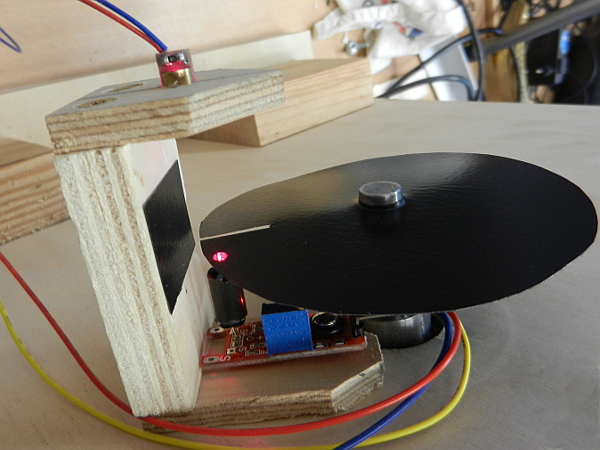
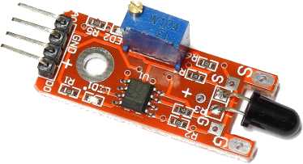

# RpsRpi
## Measuring motor cycles per second with a Raspberry Pi 3 and IR-Emitter/IR-Receiver
This project is composed of two individual project parts combined to be able to measure and display the rounds per second of a revving motor. Bouncing and timeoverflow is configurable.

The cycle rotation is measured by a IR-receiver applied with a 0.5W Infrared-LED which is interrupted by a black sliced disc. One rotation --> one rising/falling edge to compute.

The first part of the project is a QT-console-project measuring/computing the IR-signals and writing the results (rounds per second) to a SQLite-database. This project utilizes 3 threads and 2 fifo-queues within the QT-console-project. The first (high-priority) thread gets the IR-signal, the second computes values, the third writes database entries.

