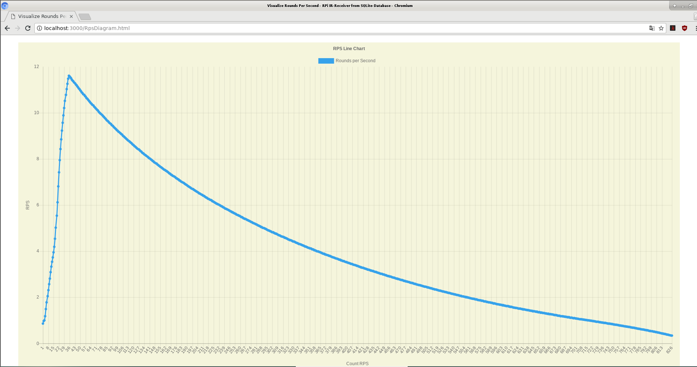

# RpsRpi
## Measuring motor cycles per second with a Raspberry Pi 3 and IR-Emitter/IR-Receiver
This project is composed of two individual projects combined to be able to measure and display the rounds per second of a revving motor. Bouncing and timeoverflow is configurable. 

The two projects are available as two branches: 
+ [RpsSQLiteNodejs](https://github.com/emmerlin1/RpsRpi/tree/RpsSQLiteNodejs)

The cycle rotation is measured by a IR-receiver applied with a 0.5W Infrared-LED which is interrupted by a black sliced disc.

